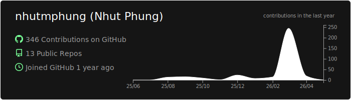
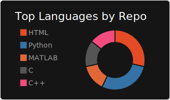
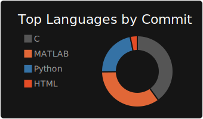
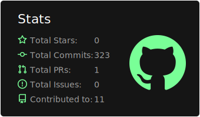

# Nhut Phung 🥜

## 
## 

---

### "The world rewards audacity, not potential."  

### "To love the process, rather than love the result." 

---

### 🛠️ *Current Tech Stack and Software I'm using/learning* 🛠️
**Programming Languages** 🖥️

       

**Modeling & Hardware Tools** 🔋

**Developer Tools** ⚙️

---

### GitHub Stats

  
   
  
  
   
  
  

---

