# Nhut Phung 🥜

## *About me*: 

### "The world rewards audacity, not potential. Be audacious, be bold, be you, show the world who you are." 

### "Full time meat head, part time engineer." 

### "To love the process, rather than love the result." 

---

### 🛠️ *Current Tech Stack and Software I'm using/learning* 🛠️
Programming Languages  

Modeling & Hardware Tools

Developer Tools

Industry Experience Software
---

### GitHub Stats

---

