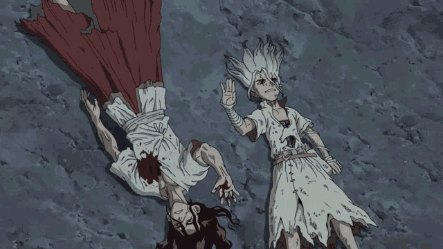

## 

 

---
### "The world rewards audacity, not potential."  

### "The man who loves walking will walk further than the man who loves the destination." 

### "A candle doesn't lose it's light by lighting another." 

---
